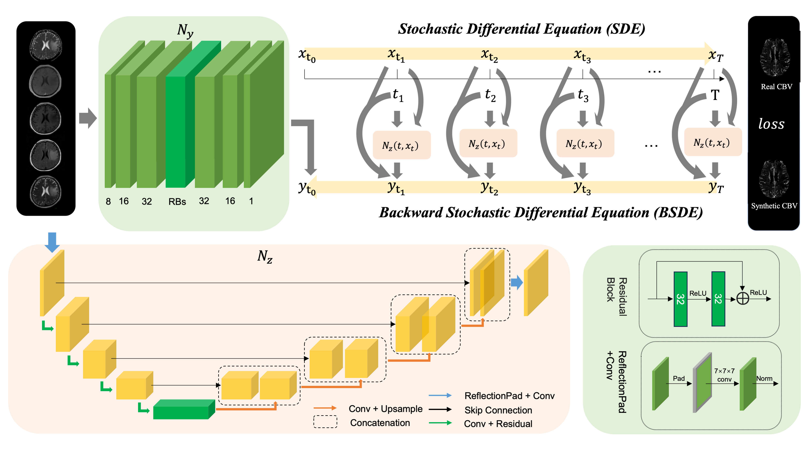

# BSDE_Generative_Model

Code for our paper 
*Backward Stochastic Differential Equations-guided Generative Model for Cross-modality Brain Image Synthesis*

## Table of Contents
- /dataloader: our dataloaders
- /network: BGM with different network 
- bsde_evl.py: inference code for CBV
- bsde_evl_UCSF.py: inference code for DWI and T1C images
- train_BSDE_DDP_CBV.py: training code for generate CBV image
- train_BSDE_DDP_UCSF.py: training code for generate DWi and T1C images
